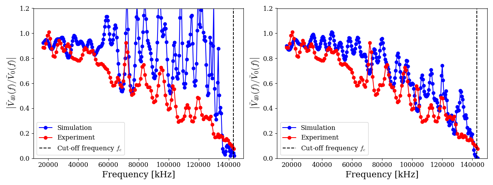
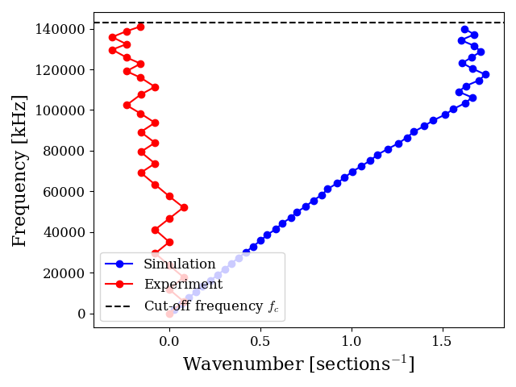
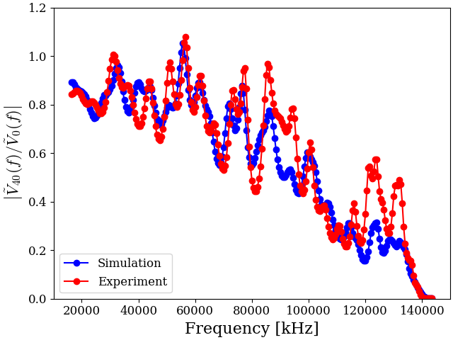

# Laboratory Waves: Inverse Problem on an LC Transmission Line


## Abstract

This project focuses on the study of a discrete, finite $LC$ transmission line—a physical system consisting of a coupled chain of inductors ($L$) and capacitors ($C$). While theoretical models often treat such lines as ideal, physical implementations suffer from deviations such as parasitic resistances, component manufacturing tolerances, and frequency-dependent AC losses (like the skin effect) that dramatically alter wave propagation, signal attenuation, and dispersion characteristics. 

To address this, we developed a fast forward model using an RK4 ODE solver that simulates wave propagation across the entire line, taking into account these parasitic effects. Using large-scale Monte Carlo simulations of the line under varied input signals (Gaussians, sines, pulses), we train Convolutional Neural Networks (CNNs) to solve the **inverse problem**: taking observed, noisy transfer signals as input and regressing the exact underlying distribution of $L$ and $C$ components, accurately characterizing the real physical system.

## Quick Start

1. **Clone the repository:**
   ```bash
   git clone https://github.com/saul-diaz-mansilla/laboratory-waves.git
   cd laboratory-waves
   ```

2. **Install requirements:**
   ```bash
   pip install -r requirements.txt
   ```

3. **Get the data:**
   Because running millions of detailed RK4 simulations takes a long time, we strongly advise downloading the heavy, pre-computed simulation datasets from Google Drive:
   - [Download Simulated Data Here](https://drive.google.com/drive/folders/1u-HSRnly0iDv49bZHjdgKWLGJ4ZRDhj4?usp=drive_link)
   
   *Note: The trained neural network models are automatically downloaded from GitHub as they are already included in the repository.*
   
   If you prefer to generate the data yourself, you may run the following script (warning: lengthy process):
   ```bash
   ./cached_sims.sh
   ```

4. **Run the pipeline:**
   Once dependencies and data are ready, execute the entire pipeline:
   ```bash
   ./run_pipeline.sh
   ```

## Physical Background

The discrete $LC$ transmission line consists of $N$ cascaded stages. Taking parasitic resistive elements into account, the transient behavior of the circuit is governed by the following state-space differential equations, linking nodal voltages $V_i$ and branch currents $I_i$:

- **Input Node (0):**
  ```math
  C_0 \frac{dV_0}{dt} = \frac{V_{\text{in}} - V_0}{R_{\text{in}}} - I_0
  ```
- **Intermediate Nodes ($1 \le i \le N-2$):**
  ```math
  C_i \frac{dV_i}{dt} = I_{i-1} - I_i
  ```
- **Final Output Node ($N-1$):**
  ```math
  C_{N-1} \frac{dV_{N-1}}{dt} = I_{N-2} - \frac{V_{N-1}}{R_{\text{out}}}
  ```
- **Inductive Branches ($0 \le i \le N-2$):**
  ```math
  L_i \frac{dI_i}{dt} = V_i - V_{i+1} - R_{L,\text{AC}}(f) \, I_i
  ```

**Frequency-Dependent AC Losses:**
A critical factor in modeling real transmission lines is that the parasitic series resistance $R_L$ is not constant. Due to high-frequency skin and proximity effects, it scales dynamically. We model this behavior using a power-rule:
```math
R_{L, \text{AC}}(f) = R_{L, \text{DC}} \left(1 + k f^p\right)
```
where $p$ is an experimentally fitted exponent and $f$ is the excitation frequency.

## Repository Architecture

```text
laboratory-waves/
├── configs/          # YAML configuration files for different experiments and circuits
├── data/             # Experimental (raw & processed) and generated simulation parquet files
├── figures/          # Plots and visualizations generated by the scripts
├── scripts/          # Numbered pipeline scripts (01 to 10) for filtering, simulation, training, and inference
└── src/
    ├── inference/    # PyTorch dataset definitions, customized MSE loss, and CNN architectures
    ├── simulation/   # Physics models: Numba RK4 ODE solver, Monte Carlo dynamics, and signal processing
    └── utils/        # Shared tools for IO (YAML/Parquet) and Matplotlib visualization standards
```

## Results Gallery

<p align="center">
  <br>
  <em>Comparison between experimental and simulated transfer functions, highlighting how incorporating frequency-dependent resistance corrects high-frequency dispersion and attenuation.</em>
</p>

<p align="center">
  <br>
  <em>Experimental vs. Simulated dispersion relation of the discrete transmission line.</em>
</p>

<p align="center">
  <br>
  <em>Transfer function predicted by physical parameters obtained through the 2D CNN inference model, compared against the target ground truth.</em>
</p>
