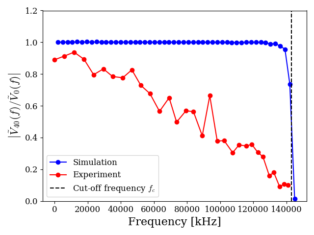
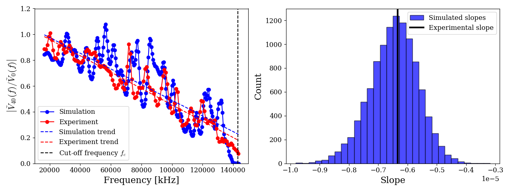
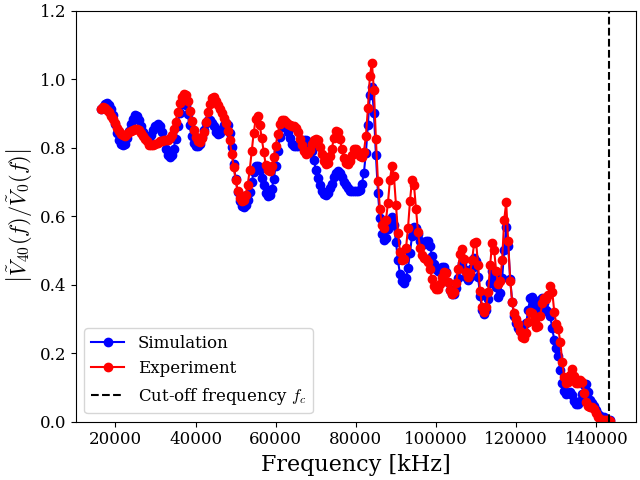

# Laboratory Waves: Inverse Problem on an LC Transmission Line


## Abstract

This project focuses on the study of a discrete, finite $LC$ transmission line, a physical system consisting of a coupled chain of inductors ($L$) and capacitors ($C$). While theoretical models often treat such lines as ideal, physical implementations suffer from deviations, mainly the high manufacturing tolerances on L and C, which break down filter behavior of the line and introduce complex resonances into the system.

To address this, we developed a fast forward model using an RK4 ODE solver that simulates wave propagation across the entire line, taking into account these parasitic effects. Using large-scale Monte Carlo simulations of the line under varied input signals (Gaussians, sines, pulses), we train Convolutional Neural Networks (CNNs) to solve the **inverse problem**: taking observed, noisy transfer signals as input and regressing the exact underlying distribution of $L$ and $C$ components, accurately characterizing the real physical system.

## Quick Start

1. **Clone the repository:**
   ```bash
   git clone https://github.com/saul-diaz-mansilla/laboratory-waves.git
   cd laboratory-waves
   ```

2. **Install requirements:**
   ```bash
   pip install -r requirements.txt
   ```

3. **Get the data:**
   Because running millions of detailed RK4 simulations takes a long time, we strongly advise downloading the heavy, pre-computed simulation datasets from Google Drive:
   - [Download Simulated Data Here](https://drive.google.com/drive/folders/1u-HSRnly0iDv49bZHjdgKWLGJ4ZRDhj4?usp=drive_link)
   
   *Note: The trained neural network models are automatically downloaded from GitHub as they are already included in the repository.*
   
   If you prefer to generate the data yourself, you may run the following scripts (warning: lengthy processes):

   To run the simulations:
   ```bash
   ./cached_sims.sh
   ```

   To train the neural network models:
   ```bash
   ./train_models.sh
   ```

4. **Run the pipeline:**
   Once dependencies and data are ready, execute the entire pipeline:
   ```bash
   ./run_pipeline.sh
   ```

## Physical Background

<p align="center">
  <br>
  <em>Experimental measurement setup for the discrete LC transmission line.</em>
</p>

### Ideal Filter Behavior

An ideal transmission line behaves fundamentally as a low-pass filter with a distinct cut-off frequency $f_c$, given by:
```math
f_c = \frac{1}{\pi \sqrt{LC}}
```
For frequency components below $f_c$, the line exhibits constant transmission characteristics, allowing signals to propagate uniformly. Once the excitation frequency exceeds $f_c$, the line enters the stopband, abruptly blocking signal transmission. 

Furthermore, the line possesses a characteristic impedance $Z_0$, dictating the relationship between voltage and current waves:
```math
Z_0(f) = \sqrt{\frac{L/C}{1-(f/f_c)^2}}
```
To ensure perfect wave propagation and effectively behave as an infinite line, the system must be properly matched by connecting a termination resistor $R_{\text{out}} = Z_0$ at its boundary. This eliminates any backward reflections and resulting standing waves.

### State-Space Differential Equations

The discrete $LC$ transmission line consists of $N$ cascaded stages. Taking parasitic resistive elements into account, the transient behavior of the circuit is governed by the following state-space differential equations, linking nodal voltages $V_i$ and branch currents $I_i$:

**Input Node (0):**
```math
C_0 \frac{dV_0}{dt} = \frac{V_{\text{in}} - V_0}{R_{\text{in}}} - I_0
```

**Intermediate Nodes ($1 \le i \le N-2$):**
```math
C_i \frac{dV_i}{dt} = I_{i-1} - I_i
```

**Final Output Node ($N-1$):**
```math
C_{N-1} \frac{dV_{N-1}}{dt} = I_{N-2} - \frac{V_{N-1}}{R_{\text{out}}}
```

**Inductive Branches ($0 \le i \le N-2$):**
```math
L_i \frac{dI_i}{dt} = V_i - V_{i+1} - R_{L,\text{AC}}(f) \, I_i
```

### Deviations from Ideal Behavior

In physical implementations, components deviate from ideal characteristics. **High manufacturing tolerances** in local $L$ and $C$ values cause each segment of the line to exhibit a slightly different characteristic impedance. This continuous mismatch across sections **breaks down the smooth low-pass filter behavior**, triggering localized reflections that manifest as standing waves and intricate resonances throughout the line's frequency response. This is the **most important effect** to account for when modelling the transmission line.

Another critical factor is frequency-dependent AC losses. The parasitic series resistance $R_L$ of the inductors is not constant, it scales dynamically. We model this scaling using a power-rule:
```math
R_{L, \text{AC}}(f) = R_{L, \text{DC}} \left(1 + k f^p\right)
```
where $p$ is an experimentally fitted exponent and $f$ is the excitation frequency.

## Simulation Methods

To resolve the complex transient wave dynamics along the non-ideal discrete line, a custom simulator was implemented in the `src/simulation` module. A highly optimized, internal Runge-Kutta 4th Order (RK4) ordinary differential equation solver—accelerated by `Numba`—efficiently integrates the $2N-1$ state equations while simultaneously simulating parallel frequencies. 

This forward model is immersed within a Monte Carlo framework to synthesize randomized datasets. By scattering the base tolerance levels, component drifts, scaling exponents, and ambient noise floors, the generator yields highly realistic and varied profiles. Specialized signal processing pipelines then extract and construct empirical frequency or time domain observables (e.g., dispersion relations or transfer functions under Gaussian, sinusoidal, and pulsed waveform excitations).

## Repository Architecture

```text
laboratory-waves/
├── configs/          
│   ├── circuit/      # Base tolerances and values for physical components (L, C, Parasitics)
│   ├── experiment/   # Master configuration combining circuit, simulation, and input waveforms
│   └── simulation/   # Monte Carlo hyperparameters, random bounds, and ODE solver settings
├── data/             # Experimental (raw & processed) and generated simulation parquet files
├── figures/          # Plots and visualizations generated by the scripts
├── notebooks/        # Jupyter notebooks for data analysis and results visualization
├── scripts/          # Numbered pipeline scripts (01 to 10) for filtering, simulation, training, and inference
└── src/
    ├── inference/    # PyTorch dataset definitions, customized MSE loss, and CNN architectures
    ├── simulation/   # Physics models: Numba RK4 ODE solver, Monte Carlo dynamics, and signal processing
    └── utils/        # Shared tools for IO (YAML/Parquet) and Matplotlib visualization standards
```

## Results Gallery

<p align="center">
  <br>
  <em>Transfer function genereated by the ideal model (zero tolerance on L and C and no resistance on inductors) compared against the experimental transfer function.</em>
</p>

<p align="center">
  <br>
  <em>Comparison between experimental and simulated transfer functions, highlighting how incorporating frequency-dependent resistance corrects high-frequency dispersion and attenuation. On the left, no resistance frequency scaling is considered, and on the right, we take frequency scaling with exponent p around 1.25.</em>
</p>

<p align="center">
  <br>
  <em>Experimental vs. Simulated dispersion relation of the discrete transmission line. The blue shaded region encloses the upper and lower bounds for the simulation given the high manufacturing tolerances on L and C.</em>
</p>

<p align="center">
  <br>
  <em>On the left, linear trends of the transfer function for the experimental data and one Monte Carlo simulation are represneted. On the right, a histogram of the slopes of the Monte Carlo simulation over 1,000 simulations is shown. The spread of this distribution is a consequence of the Monte Carlo method used to generate the simulations.</em>
</p>

<p align="center">
  <br>
  <em>Transfer function predicted by physical parameters obtained through the 2D-only-magnitude CNN inference model (represented as simulation) vs the ground truth (represented as experiment).</em>
</p>

All data discussion is located in notebooks/results_analysis.ipynb.

## References

[1] Richard P. Feynman, Robert B. Leighton, and Matthew Sands. The Feynman Lectures on Physics, Vol. II: The Electromagnetic Field. Addison-Wesley, 1964.

[2] John R. Taylor. Classical Mechanics. University Science Books, 2005. See Chapter 16 for the Wave Equation in Continuous Media.

[3] Mark Newman. Computational Physics. CreateSpace Independent Publishing Platform, 2013. Includes numerical solutions for the heat and wave equations.

[4] Thornton, S. T. and Marion, J. (2019). Classical dynamics of particles and systems, pages 498–507. MTM.

[5] Bourns. SRR7045 Series - Shielded SMD Power Inductors, 2013. Rev. 02/13.

[6] Charles Baynham and Richard Hobson. 2nd Year Lab - Thermal and Electrical Waves Experiment Script. Blackett Laboratory, Physics Department, Imperial College London, 2025.

[7] Paul Horowitz and Winfield Hill. The Art of Electronics. Cambridge University Press, Cambridge, 3rd edition, 2015. pp. 1109–1110.

[8] Muhlethaler, J., Biela, J., Kolar, J. W., and Ecklebe, A. (2011). Improved core-loss calculation for magnetic components employed in power electronic systems. IEEE Transactions on Power electronics, 27(2):964–973.
